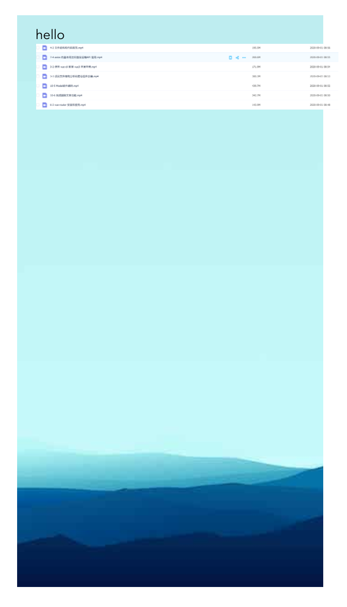

# Imooc Lego 业务组件库

### 提供一个业务组件库在编辑器和 H5 页面中都可以使用
该组件包导出两种格式的模块，供不同情况下使用

```javascript
  // umd 格式
  "main": "dist/lego-components.umd.js",
  // es modules 格式
  "module": "dist/lego-components.esm.js",
```

## 安装和使用

```bash
// 安装
npm install lego-components --save
```

```javascript
import Lego from 'lego-components'
// 加载样式
import 'lego-components/dist/lego-components.css'

const app = createApp(App)
// 全局引入 目前包括 FinalPage, LText, LImage , Lshape三个组件
app.use(Lego)

app.mount('#app')
```

### 渲染最终页面
```javascript
setup() {
  // 使用 finalPage 组件进行渲染，使用我们预定义好的数据结构
  const testData = {
    // 页面上面一个个组件的属性
    components: [
      {id: '123', name: 'l-text', props: { text: 'hello', top: '0', left: '20px'}},
      {id: '234', name: 'l-image', props: { imageSrc: 'http://vue-maker.oss-cn-hangzhou.aliyuncs.com/vue-marker/5f6338e666336111f73d220c.png', top: '30px', left: '20px'}},
      {id: '235', name: 'l-shape', props: { backgroundColor: 'red', top: '50px', left: '20px', width: '100px', height: '100px'}},
      // 这是一个链接
      {id: '345', name: 'l-text', props: { backgroundColor: "#1890ff", color: "#ffffff", text: "按钮内容",  width: "100px", actionType: "to", url: "http://www.baidu.com", top: '200px', left: '150px',
      }}
    ]
  }
  return {
    testData
  }
}
```

```html
<final-page :components="testData.components"></final-page>
```

## 最终页面效果




